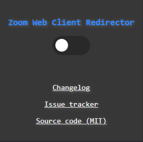
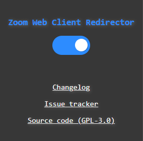

<h1 align="center">
  <sub>
    
  </sub>
  Zoom Web Client Redirector
</h1>

<p align="center">
  <a href="https://addons.mozilla.org/firefox/addon/zoom-web-client-redirector">
    </a>
  <a href="https://chrome.google.com/webstore/detail/zoom-web-client-redirecto/ommndciompclncigoffdnipifnfnaclj">
    </a>
  <a href="https://microsoftedge.microsoft.com/addons/detail/kfpmepjfaolgcgabdmbpkfnicejbiggn">
    </a>
</p>

<p align="center">
  
  
  
</p>


## Table of contents

* [Summary](#summary)
* [Description](#description)
* [Features](#features)
  - [Dark/light mode](dark/light-mode)
  - [Enable/disable extension toggle](enable/disable-extension-toggle)
* [Installation](#installation)
* [Dashboard](#dashboard)
* [Screen example](#screen-example)
* [Privacy policy](#privacy-policy)
* [Permissions](#permissions)
* [Release History](#release-history)
* [Changelog](#changelog)
* [License](#license)

## Summary

A browser extension that redirects zoom meetings to the web client version.

## Description

This project was intended to make it easier to redirect Zoom meetings links to the web client page.  
This browser addon works by replacing a portion of the url with `*/wc/join/*` so that it loads the meeting joining page. For example `https://zoom.us/j/0123456789` would be converted to `https://zoom.us/wc/join/0123456789`.  
The web client is preferable over the desktop app because of the restriction that web browsers places on web pages, protecting your computer against malicious attacks and unauthorized access of your machine.  
For more information about best practices for securing your Zoom meetings read this blog post: [10 tips for Zoom security and privacy](https://www.kaspersky.com/blog/zoom-security-ten-tips/34729).

## Features

### Dark/light mode

According to system settings the extension's dashboard has the corresponding background.

### Enable/disable extension toggle

When opening the dashboard there is a toggle to enable or disable the extension to better control the behaviour whenever wanted.

## Installation
| **Mozilla Firefox Add-on** | **Chrome Web Store** | **Microsoft Edge** |
| :---: | :---: | :---: |
| [](https://addons.mozilla.org/firefox/addon/zoom-web-client-redirector) | [](https://chrome.google.com/webstore/detail/zoom-web-client-redirecto/ommndciompclncigoffdnipifnfnaclj) | [](https://microsoftedge.microsoft.com/addons/detail/kfpmepjfaolgcgabdmbpkfnicejbiggn) |

## Dashboard

|  |  |
| :---: | :---: |
| **Toggle Off** | **Toggle On** |

## Screen example

|  |  |
| :---: | :---: |
| **Before redirect** |**After redirect** |

## Privacy policy

Zoom Web Client Redirector does **NOT** collect any data of any kind.

## Permissions

```
"permissions": [
  "storage",
  "*://*.zoom.us/*",
  "*://*.zoomgov.us/*"
],
```

- ``storage`` is used to store the status of the button that is present in the dashboard.  
- ``*://*.zoom.us/*`` and ``*://*.zoomgov.us/*`` are necessary to get the url and modify it to redirect to the web client page.

## Release History

See the [releases pages](https://github.com/EdoardoTosin/Zoom-Web-Client-Redirector/releases) for a history of releases and highlights for each release.

## Changelog

For more details see [Changelog](/CHANGELOG.md)

## License

Copyright (c) 2021 Edoardo Tosin

This software is released under the terms of the GNU General Public License v3.0. See the [LICENSE](/LICENSE) file for further information.
